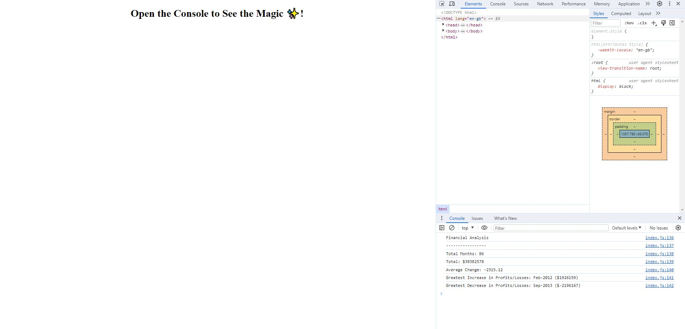

# Console-Finances
A repo for analysing the financial records of a company.

## Description

This project aims to answer a series of questions about the performance of a company.

## Table of Contents

- [Installation](#installation)
- [Usage](#usage)
- [Credits](#credits)
- [License](#license)

## Installation

Follow the URL link provided: https://jsskilton.github.io/Console-Finances/

## Usage

Navigate to the console to see the answers.

## Credits

This README was created by following the Good-README-Guide on git.bootcampcontent:

https://git.bootcampcontent.com/uk-edx-16-week/UK-VIRT-FE-PT-10-2023-U-LOLC/-/blob/main/01-html-git-github-module/04-code-refactor-lesson/challenge/Good-README-Guide.md

## License

MIT License